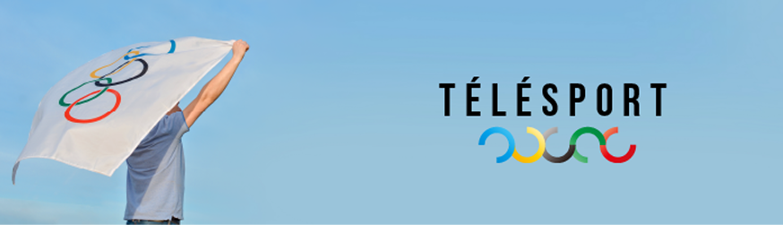

# OlympicGames 🥇🏆
An Angular project aimed at showcasing information about the Olympic Games, 
including participating countries, medals won, disciplines, and more.

## Technologies
- Angular
- RxJS
- Highcharts

## Features 🌟
- Global pie chart showcasing the distribution of medals among countries.
- Detailed line chart  for each country with their participation history and amount of medals for participation.

## Prerequisites 📋
- [Node.js](https://nodejs.org/fr) and npm installed.
- [Angular CLI](https://github.com/angular/angular-cli) installed.

## Installation 💻
1. Clone the repository: 
    >`git clone https://github.com/jeremyMulet/OlympicGamesStarter.git
2. Navigate to the directory:
    >`cd OlympicGamesStarter\`
3. Install dependencies: 
    >`npm install`

## Development server

For a dev server Run:
>`ng serve`
And navigate to `http://localhost:4200/`. 

The application will automatically reload if you change any of the source files.

## Build

Run `ng build` to build the project. The build artifacts will be stored in the `dist/` directory.
